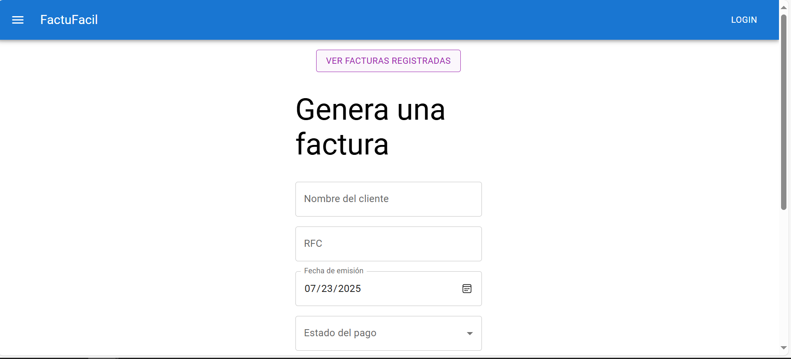
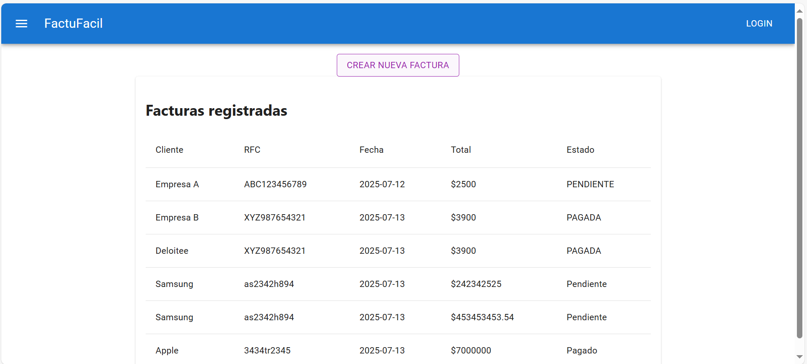

#  FactuFácil

**FactuFácil** es una aplicación web que está planeada para simplificar procesos de facturación de manera ágil, moderna y eficiente. El proyecto combina un backend robusto con una interfaz de usuario intuitiva, ideal para entornos comerciales o administrativos que buscan gestionar sus operaciones con rapidez.

---

##  Tecnologías utilizadas

### Frontend
- **React** – Librería para interfaces dinámicas
- **Material UI** – Componentes estilizados y responsivos

### Backend
- **Spring Framework**
- **Spring Boot** – Configuración simplificada y estructura modular

### Base de datos
- **MySQL** – Relacional, con estructura optimizada para consultas de facturación

### Capturas de pantalla 
#### Formulario de nueva factura

#### Lista de facturas generadas
